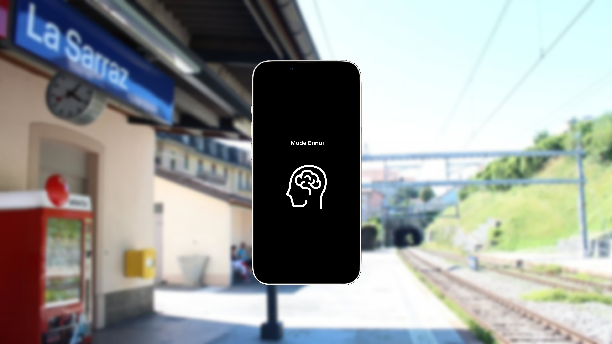

# PITCH 1

Humans are less and less inclined to be bored because of the busy contemporary lifestyle.  
Free time, identified as the time one is not working, is overladen with activities and boredom is often perceived as negative.
Taking out our phone at the bus stop, pacing up and down in the waiting room, listening to music while in the train are all part
of the scope of things we do to not have nothing to do.
The aim of this project is to define the different types of boredom people experience and see how these moments could be valued in our everyday lives.

