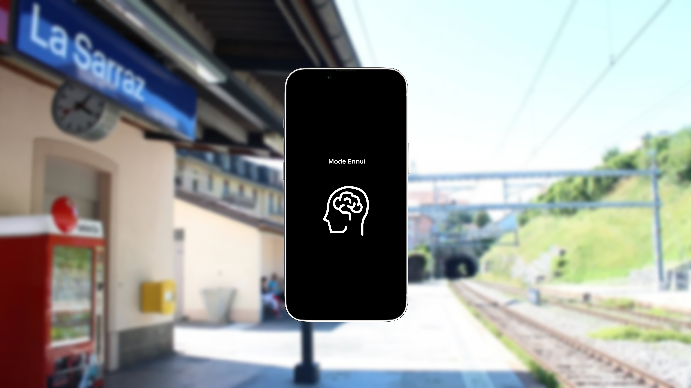

# PITCH 1

Humans are less and less inclined to be bored because of the busy contemporary lifestyle.  
Free time, identified as the time one is not working, is overladen with activities and boredom is often perceived as negative.
Taking out our phone at the bus stop, pacing up and down in the waiting room, listening to music while in the train are all part
of the scope of things we do to not have nothing to do.
The aim of this project is to define the different types of boredom people experience and see how these moments could be valued in our everyday lives.

remarques:

experience about time with people
give someone a creature without interaction and see the relationship created

put words to diffent kind of boredom 
asking different people

"time energy"

play with the gesture as time marker 

create mini experience with 

interactive experiences that are used for an instant photo and distractions more than immersive experiences

Crééer un mode ennui et le donner aux gens pour voir ce quiels en font 

or questoinnaire 

where would people like to be while being on mode ennui or where not 

see boredom as a the original / natural state of the brain/person