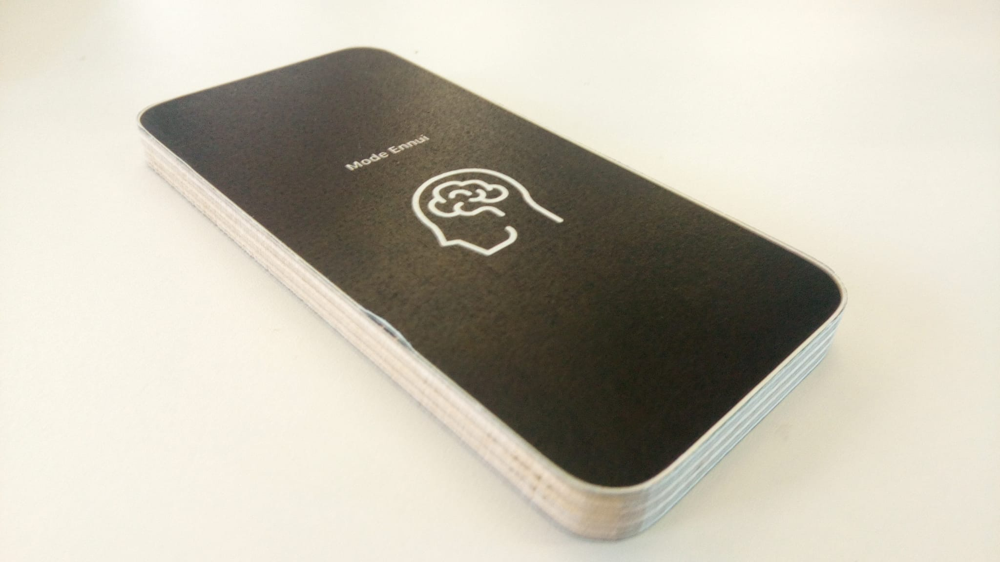

Brain out

Humans are less and less inclined to be bored because of the busy contemporary lifestyle.  
Free time, identified as the time one is not working, is overladen with activities and boredom is often perceived as negative.
Nevertheless these moments are necessary for the brain which will turn to the so-called Default Mode Network when we are not focusing on a task which is a kind of reboot.
The aim of this project is to bring out these moments. The programm would run while the user is active and restart 
when they are not, allowing the user to provoke these reboots or not.

