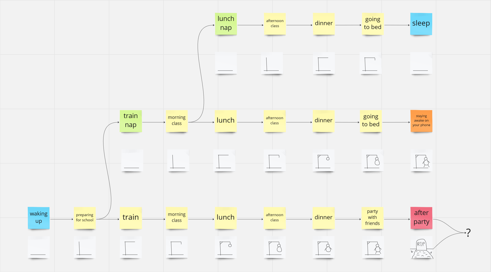

TOTIDOT

Humans are less and less inclined to be bored because of their busy contemporary lifestyle. 
Inactivity is yet an important moment for the brain which will switch to the so-called Default Mode Network when one is not focusing on a task to kind of reboot their system.

TOTIDOT uses body datas to generate a visual that let the user track their level of activity through the day. If the user enters a reboot mode so will TOTIDOT. If the user don't stop neither will TODITOT.

Time for a break or should we see how far we can push the game?

