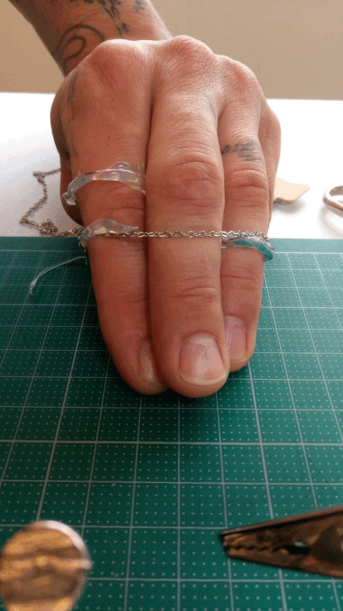

Proto 1

Humans are less and less inclined to be bored because of their busy contemporary lifestyle. 
Inactivity is yet an important moment for the brain. It switches to the so-called Default Mode Network if one is not focusing on a task. This mode is a kind of reboot for the brain.

Proto1 consists of two rings linked by a chain. It collects body datas (clamminess of hands and heartbeat) to know if you are active or not. If it detects inactivity, the chain will tighten up and lock your fingers until you go back to an activity.

